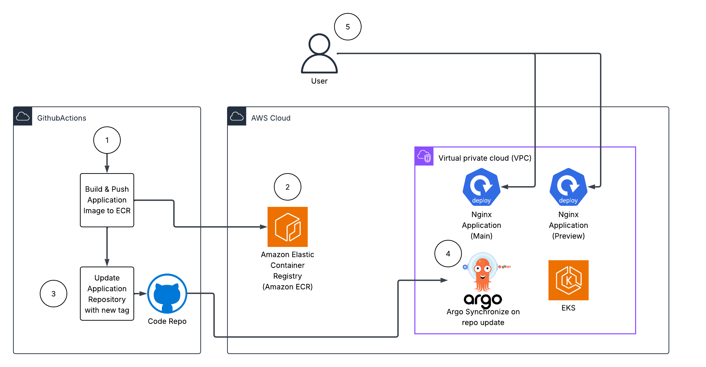

## Overview

This repository implements a complete **GitOps-based CI/CD pipeline** for containerized applications on AWS EKS using ArgoCD and Argo Rollouts. The infrastructure automates the deployment of applications with **blue/green deployment strategies**, providing zero-downtime releases and automated rollback capabilities.

### Key Features

- **🔄 GitOps Workflow**: Infrastructure and application deployments are managed through Git, ensuring declarative configuration and audit trails
- **🚀 CI/CD Pipeline**: GitHub Actions automatically builds Docker images, pushes to ECR, and updates Kubernetes manifests on every code change
- **🎯 Blue/Green Deployments**: Argo Rollouts enables safe, zero-downtime deployments with manual promotion gates
- **🛡️ Automated Rollback**: Configured to automatically rollback failed deployments within 5 minutes
- **☁️ AWS Native**: Leverages EKS, ECR, VPC, and AWS Load Balancer Controller for production-ready infrastructure
- **🔐 Secure by Default**: GitHub Actions uses OIDC for AWS authentication (no access keys stored)

### Architecture Components

1. **Infrastructure Layer** (Terraform):
   - VPC with public/private subnets and NAT Gateway
   - EKS cluster with managed node groups
   - ECR repository for Docker images
   - IAM roles and OIDC provider for GitHub Actions

2. **GitOps Layer** (ArgoCD):
   - GitOps Bridge for bootstrapping cluster addons
   - ArgoCD Application for deploying workloads
   - Automatic synchronization from Git repository

3. **Deployment Layer** (Argo Rollouts):
   - Blue/Green deployment strategy
   - Active and Preview services
   - Manual promotion gates (auto-promotion disabled by default)

4. **CI/CD Layer** (GitHub Actions):
   - Automated Docker image builds
   - ECR image push with SHA-based tagging
   - GitOps manifest updates

## Getting Started

### Prerequisites

- AWS CLI configured with appropriate credentials
- Terraform >= 1.0
- kubectl installed
- AWS permissions to create VPC, EKS, ECR resources

### Step 1: Provision Infrastructure

Deploy the infrastructure in stages for better visibility and error handling:

```bash
# Create VPC and networking components
terraform apply -target="module.vpc" -auto-approve

# Create EKS cluster and node groups
terraform apply -target="module.eks" -auto-approve

# Create remaining resources (ECR, IAM roles, outputs)
terraform apply -auto-approve
```

### Step 2: Configure kubectl

Connect your local kubectl to the EKS cluster:

```bash
aws eks --region us-west-2 update-kubeconfig --name getting-started-gitops
```

Verify access:

```bash
kubectl get nodes
```

### Step 3: Bootstrap GitOps Addons

Bootstrap ArgoCD and cluster addons using the GitOps Bridge:

```bash
kubectl apply --server-side -f bootstrap/addons.yaml
```

Wait for ArgoCD to be ready (this may take 2-3 minutes):

```bash
kubectl wait --for=condition=ready pod -l app.kubernetes.io/name=argocd-server -n argocd --timeout=300s
```

### Step 4: Access ArgoCD UI

Get the ArgoCD access credentials:

```bash
terraform output -raw access_argocd
```

This will display:
- ArgoCD admin username (`admin`)
- Initial admin password
- ArgoCD server URL (if LoadBalancer is configured)

Alternatively, use port-forwarding:

```bash
kubectl port-forward -n argocd svc/argo-cd-argocd-server 8080:80
# Access at http://localhost:8080
```

### Step 5: Deploy the Application

Create the ArgoCD Application that monitors the GitOps repository:

```bash
kubectl apply -f argocd-apps/nginx-gitops-demo.yaml
```

This creates an ArgoCD Application that:
- Monitors the `k8s/rollouts` directory in this repository
- Auto-syncs changes to the `nginx-demo` namespace
- Deploys the Nginx application with Argo Rollouts

### Step 6: Verify Deployment

Check ArgoCD application status:

```bash
kubectl get applications -n argocd
```

Check the rollout status:

```bash
kubectl get rollout -n nginx-demo
kubectl argo rollouts get rollout nginx-demo -n nginx-demo
```

Get the application ingress URL:

```bash
kubectl get ingress -n nginx-demo
```

## Architecture



### Architecture Flow

1. **Code Push**: Developer pushes code changes to the `nginx-app/` directory in GitHub
2. **CI Trigger**: GitHub Actions workflow automatically triggers on push to `main` branch
3. **Build & Push**: Workflow builds Docker image and pushes to Amazon ECR with SHA-based tags
4. **GitOps Update**: Workflow updates the Kubernetes manifest (`k8s/rollouts/nginx-demo-rollout.yaml`) with the new image tag and commits back to Git
5. **ArgoCD Sync**: ArgoCD detects the Git change and automatically syncs the updated manifest to the cluster
6. **Blue/Green Deployment**: Argo Rollouts creates a new "Green" revision alongside the existing "Blue" revision
7. **Preview Testing**: Green revision is available via preview service/ingress for testing
8. **Manual Promotion**: After validation, the Green revision is manually promoted to Active (Blue service switches traffic)
9. **Auto Rollback**: If deployment fails within 5 minutes, Argo Rollouts automatically rolls back to the previous revision
10. **Traffic Routing**: AWS Application Load Balancer routes production traffic to the Active service

## TODO
- [ ] Change EKS cluster name (currently hardcoded to `getting-started-gitops`)
- [x] Rollback on fail (configured with `progressDeadlineSeconds: 300`)

## Assumptions


## Future Improvements


## Test Scenarios